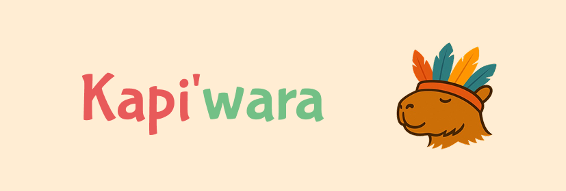

# Kapiwara App


<p align="center">
  
</p>

Uma aplicação mobile Flutter moderna usando arquitetura limpa com BLoC e Material Design 3.

## 🏗️ Arquitetura

Este projeto segue os princípios da **Clean Architecture** com **BLoC** para gerenciamento de estado:

```
lib/
├── main.dart                    # Ponto de entrada da aplicação
├── core/                        # Funcionalidades centrais
│   ├── constants/              # Constantes da aplicação
│   ├── errors/                 # Classes de erro/falha
│   ├── network/                # Cliente HTTP (Dio)
│   └── injection/              # Injeção de dependência
├── features/                   # Features da aplicação
│   └── [feature_name]/
│       ├── data/               # Camada de dados
│       │   ├── datasources/    # Fontes de dados (API, local)
│       │   ├── models/         # Modelos de dados
│       │   └── repositories/   # Implementação dos repositórios
│       ├── domain/             # Camada de domínio
│       │   ├── entities/       # Entidades de negócio
│       │   ├── repositories/   # Interfaces dos repositórios
│       │   └── usecases/       # Casos de uso
│       └── presentation/       # Camada de apresentação
│           ├── bloc/           # BLoC (eventos, estados, lógica)
│           ├── pages/          # Páginas/Telas
│           └── widgets/        # Widgets reutilizáveis
└── shared/                     # Recursos compartilhados
    ├── widgets/                # Widgets globais
    └── themes/                 # Temas da aplicação
```

## 🚀 Tecnologias Utilizadas

### Core
- **Flutter** - Framework de desenvolvimento mobile
- **Dart** - Linguagem de programação

### Gerenciamento de Estado
- **flutter_bloc** - Implementação do padrão BLoC
- **bloc** - Biblioteca base do BLoC

### Injeção de Dependência
- **get_it** - Service locator
- **injectable** - Geração automática de código para DI

### Networking
- **dio** - Cliente HTTP
- **json_annotation** - Anotações para serialização JSON

### Programação Funcional
- **dartz** - Either, Option e outras funcionalidades funcionais

### Navegação
- **go_router** - Roteamento declarativo

### Armazenamento Local
- **shared_preferences** - Persistência de dados simples

### Utilitários
- **equatable** - Comparação de objetos

### Desenvolvimento
- **build_runner** - Geração de código
- **json_serializable** - Serialização JSON automática
- **injectable_generator** - Gerador para injeção de dependência

### Testes
- **bloc_test** - Testes para BLoC
- **mocktail** - Mocking para testes

## 🎨 Design System

O projeto utiliza **Material Design 3** com:
- Tema claro e escuro automático
- Cores baseadas em Material You
- Componentes modernos e acessíveis
- Tipografia e espaçamentos consistentes

## 📱 Features Implementadas

### ✅ Splash Screen
- Animações sequenciais com gradientes personalizados
- Transições suaves entre fases
- Navegação automática para seleção de idioma

### ✅ Seleção de Idioma
- Suporte a Português e Guarani
- Persistência com SharedPreferences
- Design responsivo com validação

### ✅ Configuração de Nome
- Entrada personalizada do nome do usuário
- Validação e persistência local
- Interface responsiva

### ✅ Tela Principal (Home)
- Dashboard com saudação personalizada
- Cards de navegação para funcionalidades principais
- Avatar e sistema de notificações
- Design responsivo para diferentes tamanhos de tela

### ✅ Sistema de Clima
- Tela dedicada para informações meteorológicas
- Interface adaptativa dia/noite
- Integração com navegação principal

### ✅ Chat de Voz
- Interface para comunicação por voz
- Integração com microfone central da navegação
- Design otimizado para acessibilidade

### ✅ Contatos de Emergência
- Lista de contatos importantes
- Acesso rápido via navegação bottom
- Interface clara e funcional

### ✅ Comunidade
- Tela para interação comunitária
- Sistema de navegação integrado
- Interface responsiva

### ✅ Sistema de Alertas
- Notificações visuais na home
- Tela dedicada para alertas
- Indicadores de status

### ✅ Navegação Bottom
- Menu inferior com 5 seções principais
- Botão central de microfone com gradiente
- Navegação responsiva e intuitiva
- Estados visuais para seleção ativa

### ✅ Sistema de Temas
- Material Design 3
- Suporte a tema claro e escuro automático
- Paleta de cores personalizada
- Tipografia consistente (DINNext)

### ✅ Arquitetura
- Clean Architecture implementada
- BLoC para gerenciamento de estado
- Injeção de dependência configurada
- Estrutura modular por features

## 🛠️ Como Executar

### Pré-requisitos
- Flutter SDK (versão 3.8.0 ou superior)
- Dart SDK
- Android Studio / VS Code
- Emulador ou dispositivo físico

### Instalação

1. **Clone o repositório:**
```bash
git clone <url-do-repositorio>
cd kapiwara_app
```

2. **Instale as dependências:**
```bash
flutter pub get
```

3. **Gere os arquivos de código:**
```bash
dart run build_runner build
```

4. **Execute a aplicação:**
```bash
flutter run
```

### Análise de Código
```bash
# Análise estática
flutter analyze

# Formatação
dart format .

# Verificar dependências desatualizadas
flutter pub outdated
```

## 🏛️ Padrões de Código

### BLoC Pattern
- **Events**: Ações do usuário ou sistema
- **States**: Estados da UI
- **Bloc**: Lógica de negócio e transformação de eventos em estados

### Clean Architecture
- **Entities**: Objetos de negócio puros
- **Use Cases**: Casos de uso específicos
- **Repositories**: Interfaces para acesso a dados
- **Data Sources**: Implementações concretas de acesso a dados

### Injeção de Dependência
- Use `@injectable` para classes que devem ser injetadas
- Use `@lazySingleton` para singletons
- Configure no `injection.dart`

## 👥 Colaboradores

Agradecemos às seguintes pessoas que contribuíram para este projeto:

<table>
  <tr>
    <td align="center">
      <a href="https://github.com/vickyeqq">
        <br>
        <sub><b>Vitoria Lana</b></sub>
      </a>
    </td>
    <td align="center">
      <a href="https://github.com/evamyuu">
        <br>
        <sub><b>Evelin Brandão</b></sub>
      </a>
    </td>
    <td align="center">
      <a href="https://github.com/gabriel-steixeira">
        <br>
        <sub><b>Gabriel Souza</b></sub>
      </a>
    </td>
    <td align="center">
      <a href="https://github.com/vncys">
        <br>
        <sub><b>Vinicyus Oliveira</b></sub>
      </a>
    </td>
    <td align="center">
      <a href="https://github.com/ester-silvaa">
        <br>
        <sub><b>Ester Silva</b></sub>
      </a>
    </td>
  </tr>
</table>

## 📝 Licença

Este projeto está sob licença MIT. Veja o arquivo [LICENSE](LICENSE) para mais detalhes.

---
